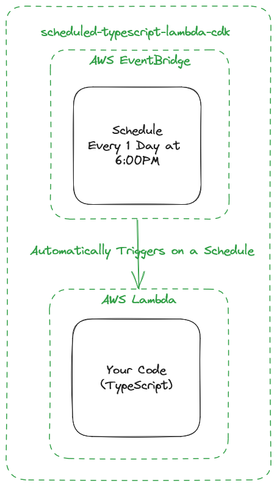

# lambda-discord-webhook

Simple template for setting up a scheduled lambda function.

Meant to be a starting point for someone to set up their own scheduled jobs running on AWS Lambda.

## Summary
Use this repository as a starting place to automate lambdas. This package will help you set up the necessary AWS Infratructure to have a lambda triggered on a schedule that will call your code.

## Prerequisites
1. Install the [AWS CDK Toolkit](https://docs.aws.amazon.com/cdk/v2/guide/cli.html)
    - You will also need Docker installed and running locally
    - Make sure to follow the instructions to get credentials set up
2. Have your choice of npm/yarn installed

## Getting started
1. Fork this repository and pull locally
   - To change the schedule edit the `cronRule` in `bin/src.ts`
   - To modify the code edit the `handler` method in `src/lambdaHandler.ts`
2. Run `npm run build` to ensure everything works
3. Run `npm run test-local` to ensure the lambdas code is working correctly
   - Use this whenever you want to test your lambda code without deploying. Make sure to build first
4. Run `cdk deploy` to deploy!
   - You'll want to re-run this any time you want to deploy new code to the lambda, or you set a new schedule
   - If you encounter a timeout issue, try modifying the timeout in `lib/typescript-lambda-stack.ts`

## Architecture
This package utilizies [AWS CDK](https://aws.amazon.com/cdk/), a tool which is used to set up AWS Infrastucture using code.
1. Set up an AWS Lambda defined in TypeScript.
2. Set up an AWS EventBridge rule that is triggered on a schedule. The schedule is defined in [cron](https://en.wikipedia.org/wiki/Cron) but other schedules can be used as well. The target of this rule is the Lambda function.

## CDK commands

- `npm run build` compile typescript to js
- `npm run watch` watch for changes and compile
- `npm run test` perform the jest unit tests
- `cdk deploy` deploy this stack to your default AWS account/region
- `cdk diff` compare deployed stack with current state
- `cdk synth` emits the synthesized CloudFormation template
